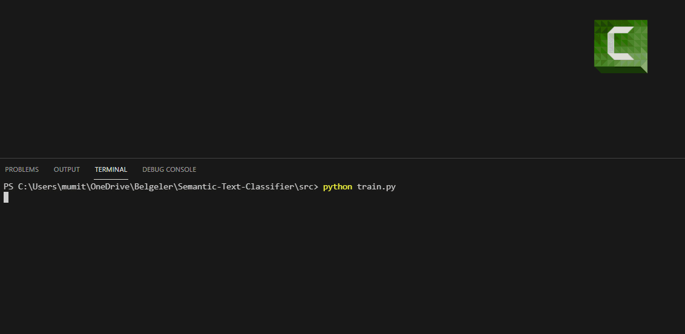
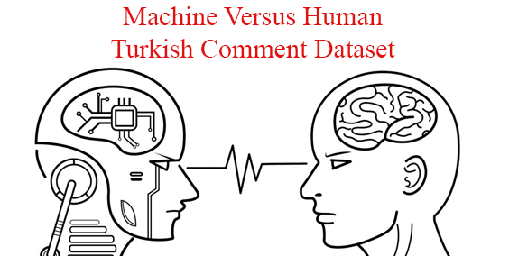

# Semantic-Text-Classifier
Machine Learning based Semantic Text Classifier using Word Embedding, TfIdf, Support Vector Machines

   

# Used Dataset :

   

I used my own dataset for classification.
In this dataset;
- I gathered real comments with crawler.
- Also fake comments created with my own Tensorflow Based Intuitive Text Generation Library: GaussNet
- Remember that Label 0 means machine-wrote and Label 1 means human-wrote text.

[Click here](https://www.kaggle.com/mitaksoylu/turkish-fakereal-comment-dataset)  to access dataset on Kaggle.

### Dependencies (Pip Packages): 
- pickle-mixin
- scikit-learn
- nltk
- numpy
- pandas
Also you can install all dependencies by running src/dependencies.sh

### For train :
Run src/train.py

This program will train and save a Support Vector Machine model & TfIDF model to disk

### For prediction : 

Run src/prediction.py

This program will predict a comment that you write is a "Human made" or "Machine Made"

Note that pre-trained model is included in "/bin" folder. So you directly run program for prediction.

